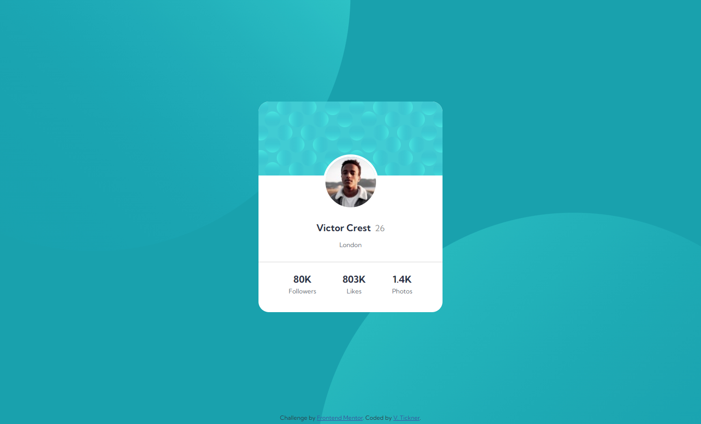
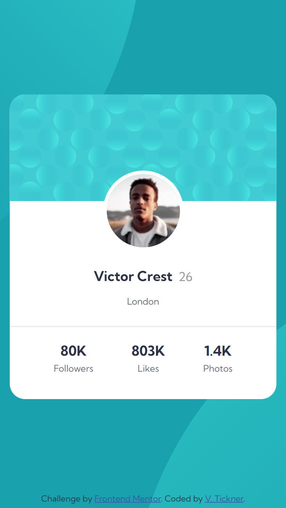

# Frontend Mentor - Profile card component solution

This is a solution to the [Profile card component challenge on Frontend Mentor](https://www.frontendmentor.io/challenges/profile-card-component-cfArpWshJ).

## Table of contents

- [Overview](#overview)
  - [Screenshots](#screenshots)
  - [Links](#links)
- [My process](#my-process)
  - [Built with](#built-with)
  - [What I learned](#what-i-learned)
  - [Continued development](#continued-development)
  - [Useful resources](#useful-resources)
- [Author](#author)

## Overview

The challenge was to build a profile card component and get the design to look as close as possible to the provided design images.

### Screenshots




### Links

- Solution URL: [https://github.com/VTickner/frontend-mentor-profile-card-component](https://github.com/VTickner/frontend-mentor-profile-card-component)
- Live Site URL: [https://vtickner.github.io/frontend-mentor-profile-card-component/](https://vtickner.github.io/frontend-mentor-profile-card-component/)

## My process

- Created semantic HTML first
- Created CSS selectors to:
  - create custom variables to contain the various colours, font sizes font weights used in the design
  - used a CSS reset
  - layout the design using Flexbox
  - style the various elements
  - added in `:focus` styling for accessibility purposes

### Built with

- Semantic HTML markup
- CSS custom properties
- Flexbox
- Google Font

### What I learned

I had difficulties in aligning the svg images that are used in the background behind the profile card. I ended up looking at [another user's solution](https://www.frontendmentor.io/solutions/profile-card-using-html-css-css-grid-mJFrIzyLAN) in order to understand how they had done it using `background-position`.

```css
background-position: right 50vw bottom 40vh, top 50vh left 45vw;
```

### Continued development

Gain extra practice in laying out more complicated background images.

### Useful resources

- [Google Fonts](https://fonts.google.com/) - The font used in this design was [Kumbh Sans](https://fonts.google.com/specimen/Kumbh+Sans).

## Author

- Frontend Mentor - [@VTickner](https://www.frontendmentor.io/profile/VTickner)
